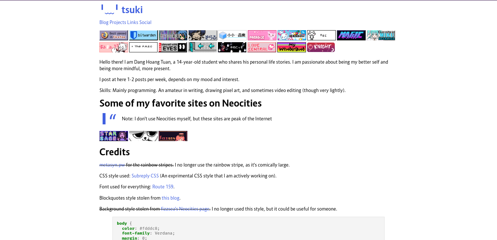
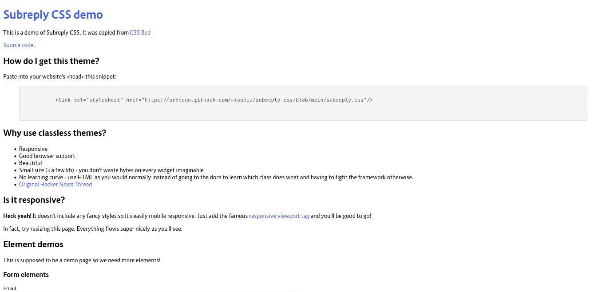

<link rel="stylesheet" href="https://cdn.statically.io/gh/HoangTuan110/subreply-css/main/subreply.css">

# Subreply CSS [](https://twitter.com/intent/tweet?text=Subreply+CSS+is+a+simple+yet+modern+and+beautiful+classless+CSS+style&url=https://github.com/HoangTuan110/subreply-css&via=DangHoangTuan20&hashtags=bootstrap,css,classless,subreply)


[](https://forthebadge.com)


Subreply CSS is a simple, yet modern and beautiful classless CSS style. It's
suitable for both personal blogs and as a bootstrap. It was influenced by the
clean social media [Subreply](https://subreply.com/about). (Hence the name)

* **Lightweight** - Only weights 4 kB! (original version)
* **Mobile responsive** and **image responsive**
* **Automatic dark/light theme** (based on OS preferences)
* **Custom emojis** before `mailto:`, `sms:`, and `tel:` links
* **Custom blockquotes** and **code blocks**
* Beautiful font ([Route 159](https://dotcolon.net/font/route159/))
* Fixing missing features from the original Subreply, such as **radios and checkboxes**

Wanna try it first? Visit the [demo](https://raw.githack.com/HoangTuan110/subreply-css/main/test.html)
or go to [my website](https://tsk.bearblog.dev), which uses Subreply CSS.

[Get it now!](#installation)

[GitHub](https://github.com/HoangTuan110/subreply-css)

# Screenshots




# Installation

You can download the file `subreply.css` or `subreply.min.css`, or paste into your website's &lt;head&gt;
this snippet:

```css
<link rel="stylesheet" href="https://cdn.statically.io/gh/HoangTuan110/subreply-css/main/subreply.css">
```

You can also use the minified version in production mode:

```css
<link rel="stylesheet" href="https://cdn.statically.io/gh/HoangTuan110/subreply-css/main/subreply.min.css">
```

# Copyright and credits

Copyright 2022-present [Dang Hoang Tuan](https://tsk.bearblog.dev).

Original code by [Lucian Marin](https://github.com/lucianmarin).

This CSS style is under the MIT license.
